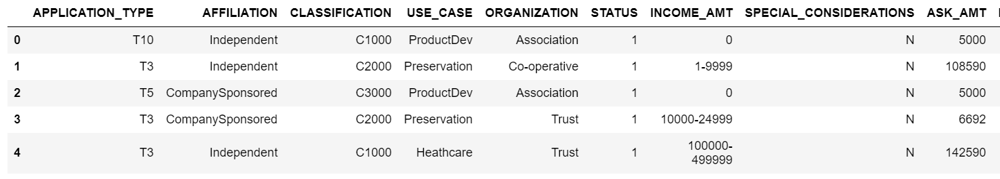
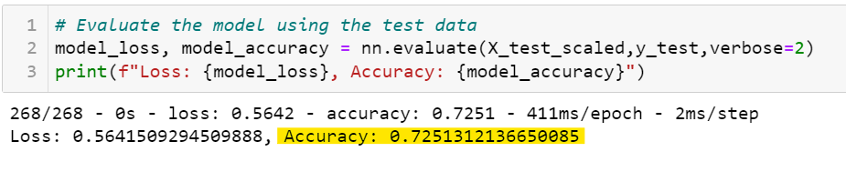
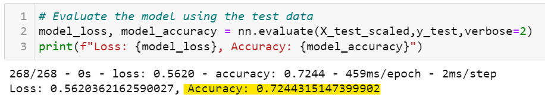

# Neural_Network_Charity_Analysis

## Overview
Using machine learning and neural networks, a binary classifier was created from features in the charity_data.csv dataset to predict the success of rate of loan applications.

## Results

### Initial Model 
- The "IS_SUCCESSFUL" column is the target variable this model attempts to predict.

- Below are the feature variables for this model


- The "EIN" and "NAME" columns were not deemed useful for this analysis and were removed from the dataframe using the following code. 
```
# Drop the non-beneficial ID columns, 'EIN' and 'NAME'.
application_df = application_df.drop(columns=['EIN', 'NAME'])
application_df.head()
```
### Optimization Attempt
In an attempt to increase the initial model's accuracy to 75% or above, the below adjustments were made.

- To access more data points from the the dataset, some categories from the "APPLICATION_TYPE" and "CLASSIFICATION" features were retrieved from the "other" bin. This was achieved  by adjsuting the comparison value in the following code snipets

    - ***from the initial model...***
    ```
    # Determine which values to replace if counts are less than ...?
    replace_application = list(application_counts[application_counts < 500].index)
    ```
    ```
    # Determine which values to replace if counts are less than ..?
    replace_classification = list(classification_counts[classification_counts < 1000].index)
    ```
    - ***from the "optimized" model...***
    ```
    # Determine which values to replace if counts are less than ...?
    replace_application = list(application_counts[application_counts < 50].index)
    ```
    ```
    # Determine which values to replace if counts are less than ..?
    replace_classification = list(classification_counts[classification_counts < 100].index)
    ```
- A third layer with 10 additional neurons was added to the model.

- The activation function was changed from "relu" to "leaky_relu" in the second layer. This was changed to determine if a different function could add insight to the model.

- The target accuracy of 75% was not achieved from the adjustments to the optimization model.
    - ***initial model...***
    
    - ***optimized model...***
    

## Summary
The accuracy scores were very similar from both models (72.5% to 72.4%). There was no improvement of consequence using the optimized model. A random forest classifier could be applied instead of the deep learning model. The random forest classifier could provide improved accuracy and/or  improved performance (less code and faster run times).


